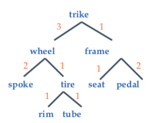
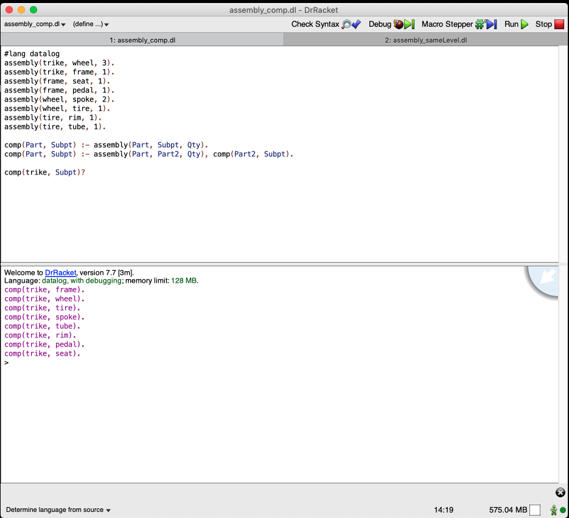
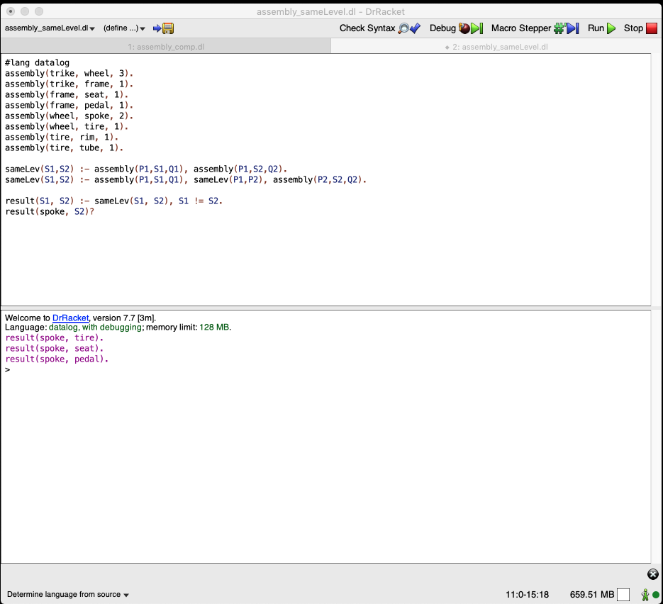
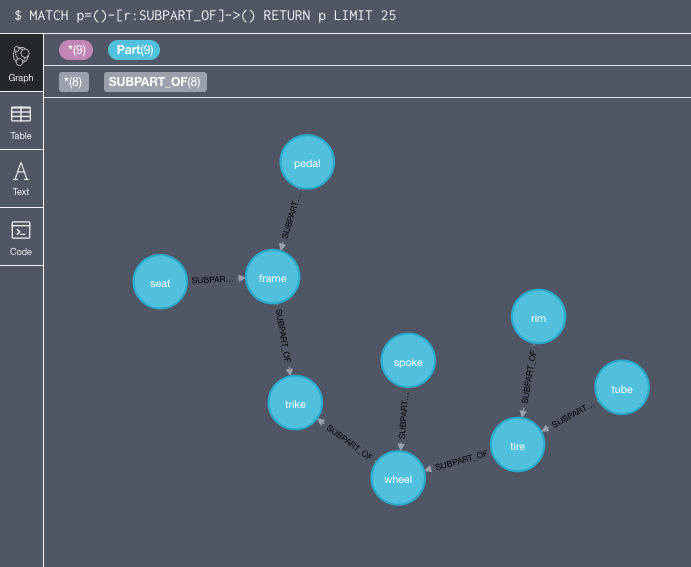

## SQL v. Datalog v. Cypher

In this document, we use a simple table shown below to compare
SQL, Datalog, and Cypher queries.

We will implement following two queries in SQL, Datalog, and Cypher:

1) Get all the components of "trike"
2) Get the components at the same level as "spoke"

   Tuple (S1,S2) is in SameLev if there is path up from S1 to some node and down to S2 with same number of up and down edges.

The working table

| Part  | Subpart | number |
|-------|---------|--------|
| trike | wheel   |  3     |
| trike | frame   | 1      |
| frame | seat    | 1      |
| frame | pedal   | 2      |
| wheel | spoke   | 2      |
| wheel | tire    | 1      |
| tire  | rim     | 1      |
| tire  | tube    | 1      |



## SQL

We use PostgreSQL 12 for our experiment. 

1. Create the table:

    ```SQL
    CREATE TABLE AssemblyInstance(
       PART    VARCHAR(10),
       SUBPART VARCHAR(10),
       NUMBER  INT);

    INSERT INTO AssemblyInstance(PART, SUBPART, NUMBER) VALUES
       ('trike', 'wheel' , 3),
       ('trike', 'frame', 1),
       ('frame', 'seat', 1),
       ('frame', 'pedal', 2),
       ('wheel', 'spoke', 2),
       ('wheel', 'tire', 1),
       ('tire', 'rim', 1),
       ('tire', 'tube', 1);
    ```

1. Get all the components of "trike":

    ```SQL
    WITH RECURSIVE Comp(PART, SUBPART) AS (
       (SELECT A1.PART, A1.SUBPART FROM AssemblyInstance A1)
     UNION
       (SELECT A2.PART, C1.SUBPART
        FROM AssemblyInstance A2, Comp C1
        WHERE A2.SUBPART = C1.PART)
    )
    SELECT * FROM Comp C2 WHERE C2.PART = 'trike';
    ```
    
    ```text
      part  | subpart
     -------+---------
      trike | wheel
      trike | frame
      trike | seat
      trike | pedal
      trike | tire
      trike | spoke
      trike | tube
      trike | rim
      (8 rows)
     ```
     
1. Get the components at the same level as "spoke":

    ```SQL
    WITH RECURSIVE SameLev(S1, S2) AS (
     (SELECT A1.SUBPART, A2.SUBPART
      FROM AssemblyInstance A1, AssemblyInstance A2
      WHERE A1.PART = A2.PART)
     UNION
      (SELECT A1.SUBPART, A2.SUBPART
       FROM AssemblyInstance A1, AssemblyInstance A2, SameLev L1
       WHERE L1.S1 = A1.PART AND L1.S2 = A2.PART)
     )
     SELECT * FROM SameLev L2 WHERE L2.S1 = 'spoke' AND L2.S1 <> L2.S2;
     ```

    ```text
        s1   |  s2
      -------+-------
       spoke | tire
       spoke | pedal
       spoke | seat
      (3 rows)
    ```

> The above queries are SQL equivalence of Datalog queries below.

## Datalog

We use [DrRacket](https://docs.racket-lang.org/datalog/Tutorial.html?q=datalog) for this section.

1. Create the table:

    ```racket-lang
    assembly(trike, wheel, 3).
    assembly(trike, frame, 1).
    assembly(frame, seat, 1).
    assembly(frame, pedal, 1).
    assembly(wheel, spoke, 2).
    assembly(wheel, tire, 1).
    assembly(tire, rim, 1).
    assembly(tire, tube, 1).
    ```
    
1. Create datalog rules to get all the components of "trike":

    ```racket-lang
    comp(Part, Subpt) :- assembly(Part, Subpt, Qty).
    comp(Part, Subpt) :- assembly(Part, Part2, Qty), comp(Part2, Subpt).
    comp(trike, Subpt)?
    ```
    
   


1. Get the components at the same level as "spoke":

    ```racket-lang
    sameLev(S1,S2) :- assembly(P1,S1,Q1), assembly(P1,S2,Q2).
    sameLev(S1,S2) :- assembly(P1,S1,Q1), sameLev(P1,P2), assembly(P2,S2,Q2).
    
    result(S1, S2) :- sameLev(S1, S2), S1 != S2.
    result(spoke, S2)?
    ```
    
    


## Cypher

We use [neo4j sandbox](https://sandbox.neo4j.com/) for this section.


1. Create a blank sandbox
1. First create a graph:

    ```Cypher
    CREATE 
    (trike:Part {name: "trike"}),
    (wheel:Part {name: "wheel"}),
    (frame:Part {name: "frame"}),
    (spoke:Part {name: "spoke"}),
    (tire:Part {name: "tire"}),
    (seat:Part {name: "seat"}),
    (pedal:Part {name: "pedal"}),
    (rim:Part {name: "rim"}),
    (tube:Part {name: "tube"}),
    (wheel)-[:SUBPART_OF]->(trike),
    (frame)-[:SUBPART_OF]->(trike),
    (spoke)-[:SUBPART_OF]->(wheel),
    (tire)-[:SUBPART_OF]->(wheel),
    (seat)-[:SUBPART_OF]->(frame),
    (pedal)-[:SUBPART_OF]->(frame),
    (rim)-[:SUBPART_OF]->(tire),
    (tube)-[:SUBPART_OF]->(tire);
    ```
    
    The graph looks like:
    
    

1. Get all the components of "trike":

    ```Cypher
    MATCH (n:Part)-[:SUBPART_OF*]->(p:Part {name:"trike"}) RETURN n.name
    ```
    
   

1. Get the components at the same level as "spoke":

    ```Cypher
    MATCH p1 = (n:Part)-[:SUBPART_OF*]->(p:Part)
    MATCH p2 = (m:Part)-[:SUBPART_OF*]->(p:Part)
    WHERE length(p1) = length(p2) AND m.name <> n.name AND n.name = "spoke"
    RETURN DISTINCT n,m
    ```
    
    
